<p align="center">
  
</p>

<h1 align="center">Infinity Threadz</h1>

<p align="center">
  <em>Where passion meets fashion</em> — a Flutter app for a fictional online clothing store.
</p>

<p align="center">
  
  
  
  
</p>

---

## About

Infinity Threadz is the shopping app for an imaginary vintage-inspired fashion label: browse the catalogue, keep a wishlist, manage a cart, follow orders from payment to delivery and check your wallet. The project covers the brand as well as the app, with a logo set, colour palette and typography that the app is built on. It shows how I structure a feature-based Flutter app, build custom UI and handle theming, forms and device features such as the camera.

The app is a **front-end showcase**. It runs on sample data with no backend, so sign-in accepts any username and password, and checkout, vouchers and card management aren't live. See [Status and roadmap](#status-and-roadmap) for what's next.

## Screenshots

<table>
  <tr>
    <td align="center">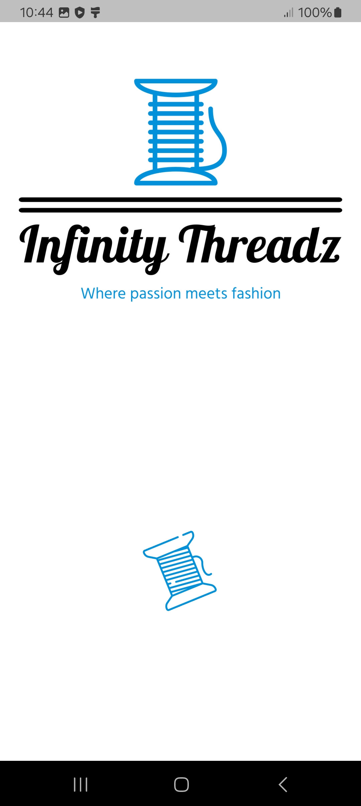<br><sub>Splash screen</sub></td>
    <td align="center">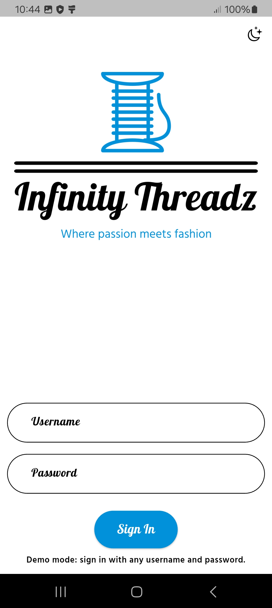<br><sub>Sign in</sub></td>
    <td align="center">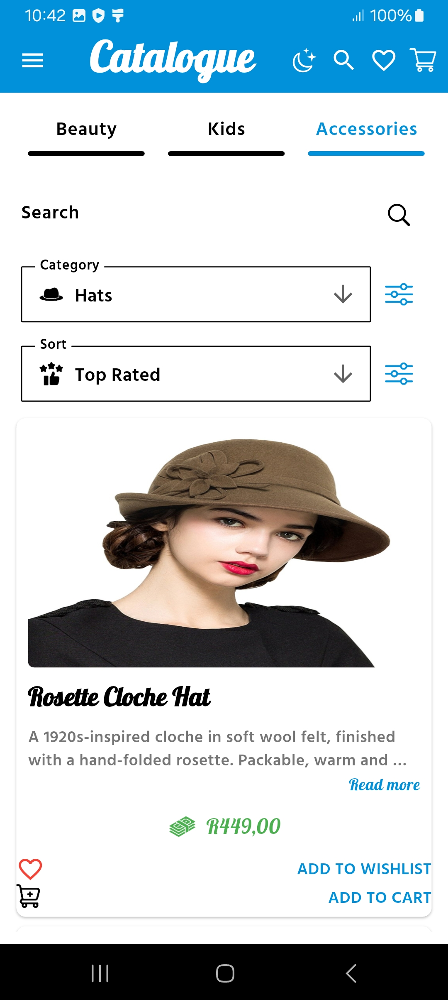<br><sub>Catalogue with filters</sub></td>
  </tr>
  <tr>
    <td align="center">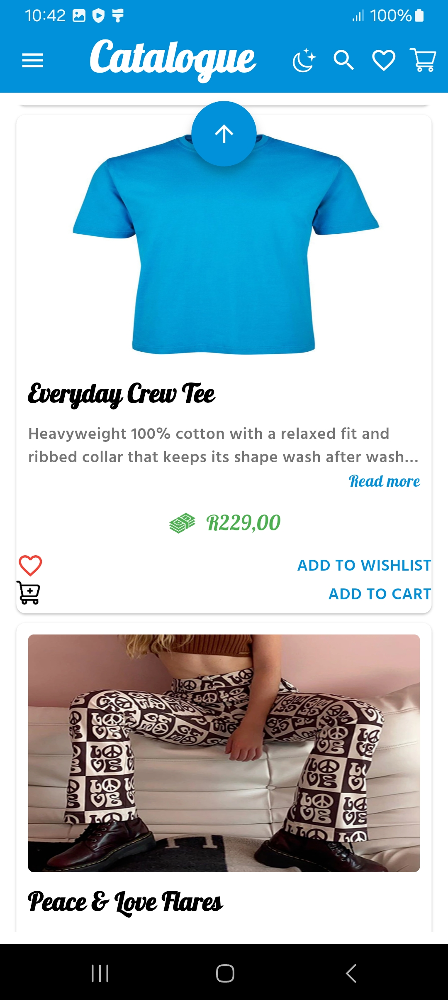<br><sub>Product cards</sub></td>
    <td align="center">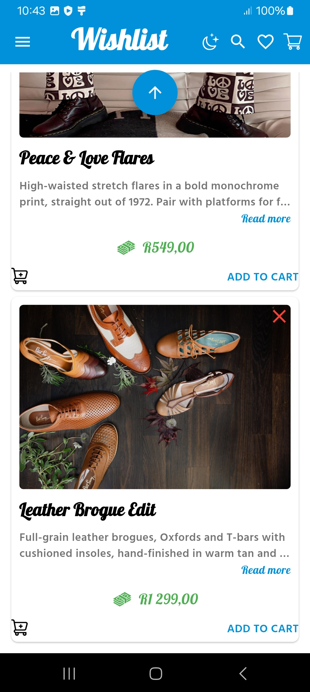<br><sub>Wishlist</sub></td>
    <td align="center">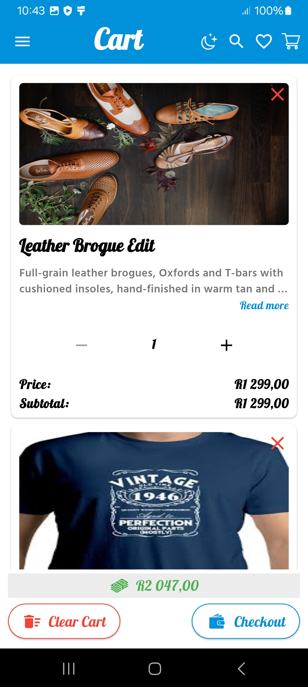<br><sub>Cart</sub></td>
  </tr>
  <tr>
    <td align="center">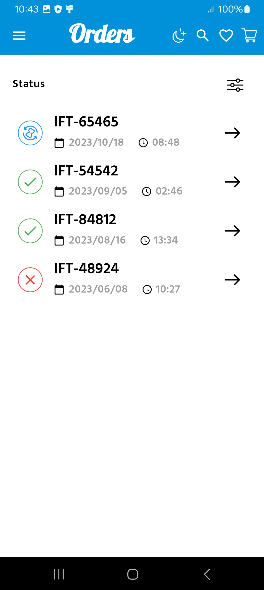<br><sub>Order history</sub></td>
    <td align="center">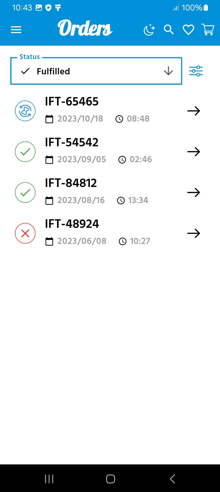<br><sub>Orders filtered by status</sub></td>
    <td align="center">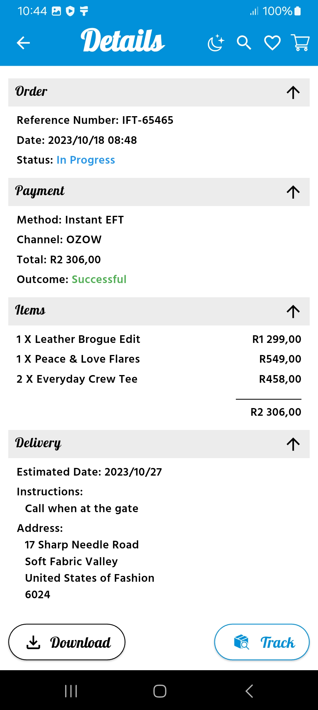<br><sub>Order details</sub></td>
  </tr>
  <tr>
    <td align="center">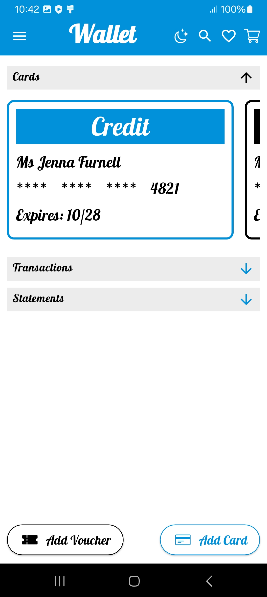<br><sub>Wallet cards</sub></td>
    <td align="center">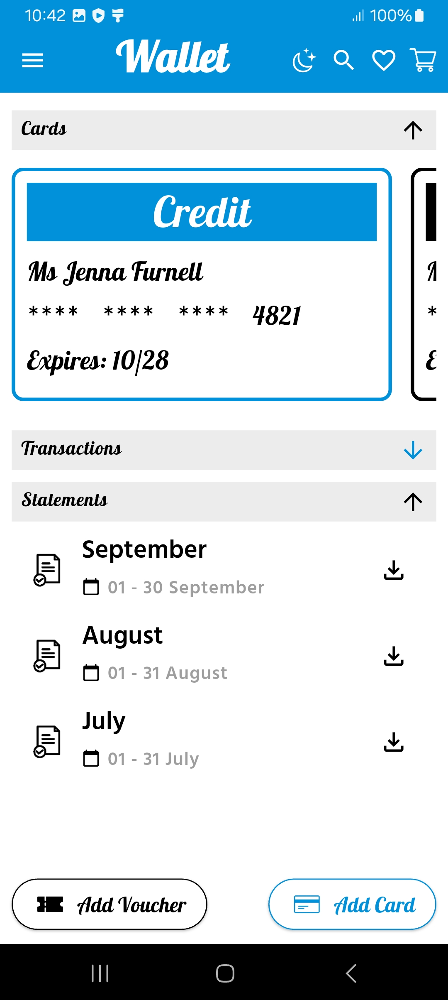<br><sub>Statements</sub></td>
    <td align="center">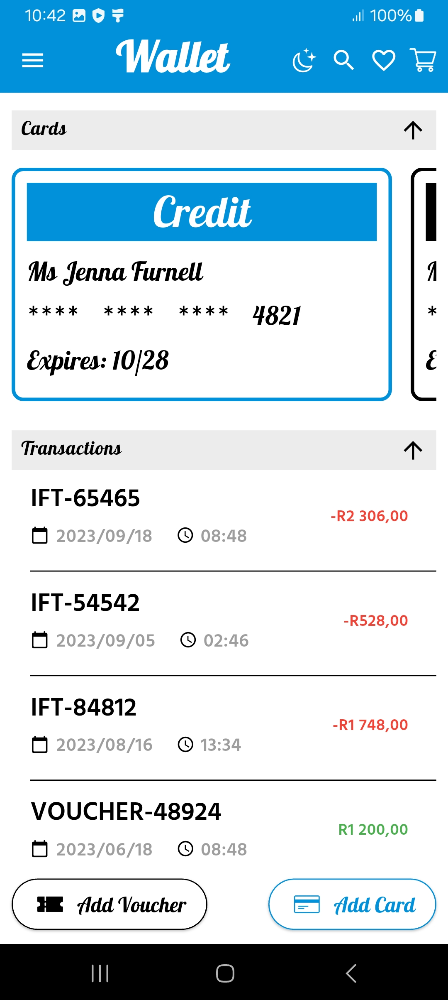<br><sub>Transactions</sub></td>
  </tr>
  <tr>
    <td align="center">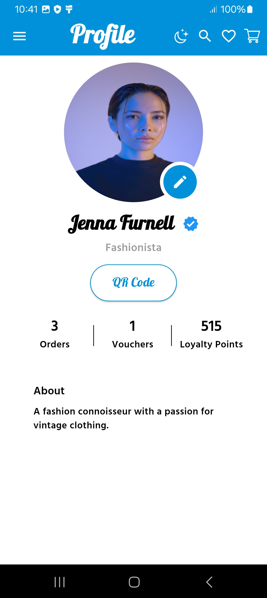<br><sub>Profile</sub></td>
    <td align="center">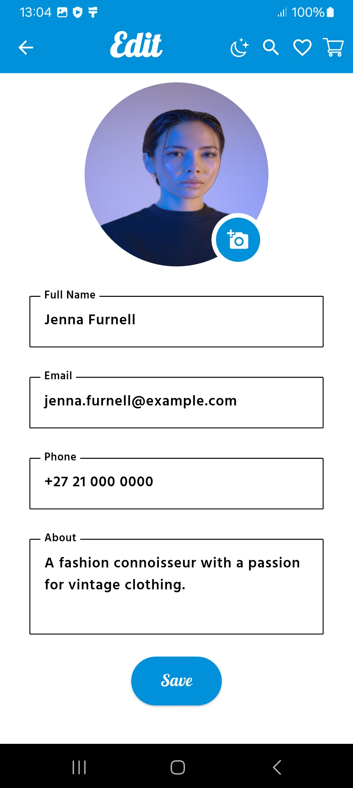<br><sub>Edit profile</sub></td>
    <td align="center"><br><sub>Take a profile photo</sub></td>
  </tr>
  <tr>
    <td align="center">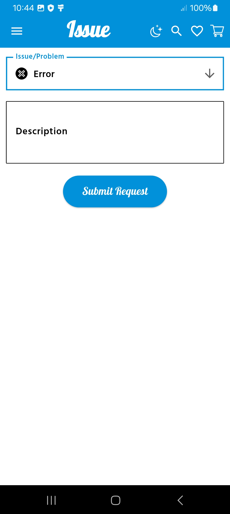<br><sub>Report an issue</sub></td>
    <td></td>
    <td></td>
  </tr>
</table>

## Features

- **Sign-in screen** with the brand logo, form validation and a light/dark toggle.
- **Catalogue**: category tabs, a search bar, category and sort filters, and product cards with expandable "read more" descriptions and add-to-wishlist / add-to-cart actions.
- **Wishlist and cart**: remove items, change quantities and see line subtotals and a running total. "Clear Cart" empties the cart.
- **Orders**: order history with status icons and a status filter, order details (order, payment, items and delivery sections that fold away) and a step-by-step tracking timeline.
- **Wallet**: swipeable account cards, recent transactions and monthly statements.
- **Profile**: order, voucher and loyalty-point stats, and an edit screen where you update your name, email, phone and bio (with validation) and take a new profile photo with the device camera.
- **Report an issue**: pick a category (performance, error, crash or enhancement), describe the problem and submit.
- **Light and dark themes** that switch with an animated circular reveal on every screen.

## Under the hood

- **Feature-first structure.** Each feature lives in its own folder (`authentication-component`, `product-catalogue-component`, `wishlist-component`, `cart-component`, `orders-component`, `wallet-component`, `user-component`, `bug-management-component`, `camera-component`) with its page, widgets and models. Shared code sits in `common/`.
- **One seam for data.** Every screen reads its sample data from `DemoData` (`common/data/demo_data.dart`), and the services (`UserService`, `BugReportService`) already expose async methods. Connecting a real API means changing those classes, not the screens.
- **One theme, one palette.** Light and dark Material 3 themes come from `AppThemes`, built on the brand blue `#0191DA` with the Galada script for headings and Hind Guntur for body text. The theme switch uses `animated_theme_switcher`.
- **Responsive layout.** Product grids go from one column on phones to two on tablets and three on wider screens, and page margins follow the same breakpoints.
- **Camera.** The profile photo uses the `camera` plugin. It prefers the front camera, records no audio and shows a clear message if camera access is denied.
- **Custom widgets.** Scrolling titles for long app-bar headings, animated collapsible section headers, filter drop-downs and a tracking timeline are all built in-house.
- **Tests and CI.** Unit tests cover the layout rules, colour helpers, user model and sample data, and widget tests cover sign-in. A GitHub Actions workflow runs `flutter analyze` and `flutter test`, builds the web app and can publish it to GitHub Pages.
- **Branded launch.** App icons for every platform are generated from one image with `flutter_launcher_icons`.

## Tech stack

| | |
|---|---|
| Framework | Flutter 3.44 (stable), Dart 3 |
| Theming | [animated_theme_switcher](https://pub.dev/packages/animated_theme_switcher) |
| Device features | [camera](https://pub.dev/packages/camera) |
| Storage | [shared_preferences](https://pub.dev/packages/shared_preferences) |
| Forms and formatting | [email_validator](https://pub.dev/packages/email_validator), [intl](https://pub.dev/packages/intl) for South African Rand formatting |
| Tooling | flutter_lints, flutter_launcher_icons, GitHub Actions |
| Android build | Gradle 8.12, Android Gradle Plugin 8.9, Kotlin 2.1, Java 17+ |

## Getting started

### Prerequisites

- [Flutter](https://docs.flutter.dev/get-started/install) 3.44 or newer
- JDK 17 or newer
- Android Studio or the Android SDK, plus an emulator or an Android phone (or Chrome, to run the web version)

### Run it

Clone the repository, then:

```bash
cd infinity_threadz
flutter pub get
flutter run
```

To run it in the browser instead, use `flutter run -d chrome`.

### Build a release APK

```bash
flutter build apk --release --split-per-abi
```

The APKs land in `infinity_threadz/build/app/outputs/flutter-apk/`. Most modern phones need `app-arm64-v8a-release.apk`.

### Run the tests

```bash
flutter analyze
flutter test
```

## Project structure

```
Infinity-Threadz/
├── Design/                 Logo set (PNG, SVG, PDF, EPS), brand board and fonts
├── docs/                   Screenshots and brand board used in this README
└── infinity_threadz/       The Flutter app
    ├── assets/images/      Product photos, icons and logos
    ├── fonts/              Bundled fonts
    ├── lib/
    │   ├── main.dart
    │   ├── authentication-component/
    │   ├── product-catalogue-component/
    │   ├── wishlist-component/
    │   ├── cart-component/
    │   ├── orders-component/
    │   ├── wallet-component/
    │   ├── user-component/
    │   ├── bug-management-component/
    │   ├── camera-component/
    │   └── common/         Sample data, theme, services and shared widgets
    └── test/
```

## Brand

The visual identity is a thread-spool mark, the *Galada* script wordmark with *Hind Guntur* for body text, and an ocean-blue accent (`#0191DA`) on black and white. The full logo set, for light and dark backgrounds, is in [`Design/`](Design).

<p align="center">
  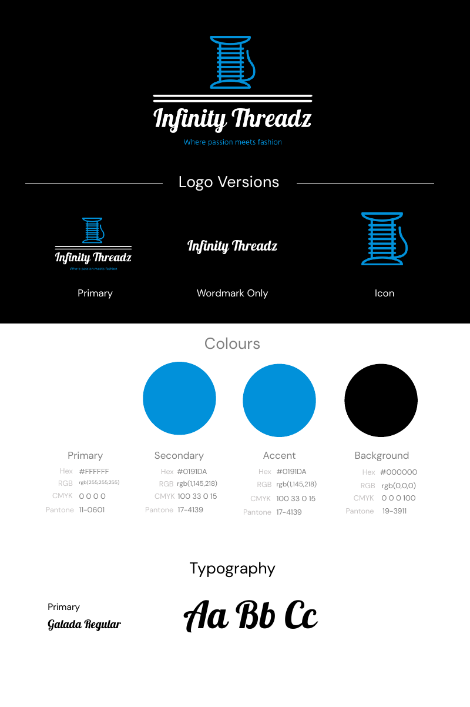
</p>

## Status and roadmap

This is a UI prototype with sample data. Planned next steps:

- [ ] Shared cart and wishlist state, so "Add to cart" and "Add to wishlist" update them
- [ ] Working catalogue search, category tabs and sort filters
- [ ] Checkout, vouchers and adding cards
- [ ] Saving profile edits between sessions
- [ ] A live web demo on GitHub Pages
- [ ] A backend for the catalogue, orders, wallet and user accounts

## Credits

- **Fonts:** [Galada](https://fonts.google.com/specimen/Galada) by Jérémie Hornus, Yoann Minet and Juan Bruce, and [Hind Guntur](https://fonts.google.com/specimen/Hind+Guntur) by the Indian Type Foundry, both under the SIL Open Font License 1.1 ([Galada](Design/Fonts/Galada/OFL.txt), [Hind Guntur](Design/Fonts/Hind_Guntur/OFL.txt)).
- **Logo:** created with [LOGO.com](https://logo.com).
- **Photos and icons:** product photos, the sample profile photo and the icons come from free stock photo and icon sites. They belong to their creators and are included for demonstration only.

## Licence

The source code is released under the [MIT Licence](LICENSE). The fonts keep their own licences (SIL OFL 1.1), and the third-party photos, icons and logo artwork are **not** covered by the MIT Licence.

## Author

**Siyabonga Mndaweni**
